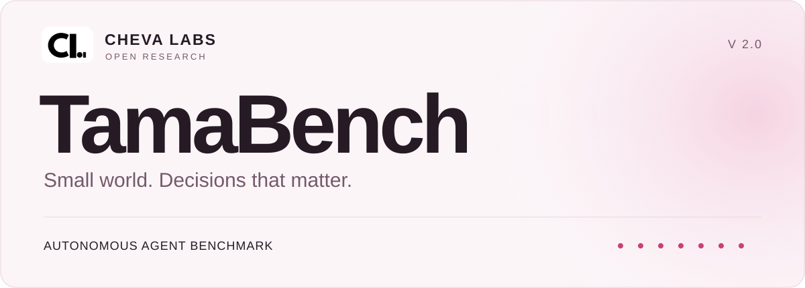

<div align="center">
  <picture>
    <source media="(prefers-color-scheme: dark)" srcset="docs/assets/tamabench-header-dark.svg">
    <source media="(prefers-color-scheme: light)" srcset="docs/assets/tamabench-header-light.svg">
    
  </picture>

  <br><br>

  <a href="https://github.com/Cheva1234/TamaBench/actions/workflows/ci.yml?query=branch%3Amain"></a>
  <a href="https://colab.research.google.com/github/Cheva1234/TamaBench/blob/main/notebooks/TamaBench_Colab.ipynb"></a>

  <h3>Seven simulated days. Every decision recorded.</h3>
  <p>Evaluate how an AI agent manages care, work, money, and energy<br>in a small world with deterministic rules and replayable evidence.</p>

  <p><a href="#1-try-a-cpu-baseline"><strong>Start locally</strong></a> &nbsp;·&nbsp; <a href="#2-test-a-hosted-model-api"><strong>Connect an API</strong></a> &nbsp;·&nbsp; <a href="#3-run-in-colab"><strong>Run in Colab</strong></a></p>
  <p><a href="docs/providers.md">Provider guide</a> &nbsp;·&nbsp; <a href="#results-resume-and-replay">Results &amp; replay</a> &nbsp;·&nbsp; <a href="#benchmark-contract-and-credibility">Benchmark contract</a> &nbsp;·&nbsp; <a href="tamabench/spec/environment_v2.yaml">Environment rules</a></p>
</div>

<br>

## A small world, built for careful comparisons

**TamaBench 2.0** is a benchmark for autonomous agents from **Cheva Labs**. Keep a virtual pet healthy while balancing work, money, inventory, and energy. Start with a CPU baseline, connect a hosted model API, or bring your own Ollama server.

| Run anywhere | Inspect every result |
| :--- | :--- |
| **CLI · Python · Colab**<br>One configuration and one implementation | **Recorded evidence**<br>Measured outcomes, explicit failures, replayable trajectories |
| **Local models or hosted APIs**<br>Ollama, OpenAI, OpenRouter, Groq, and compatible endpoints | **Deterministic environment**<br>Accelerated simulation checked against a reference engine |

> TamaBench measures performance in this environment. It does not establish a universal ranking of intelligence or autonomy. V1 and V2 results are not directly comparable.

<br>

## 1. Try a CPU baseline

Requires Python 3.10+ and Git. Install from this repository; the commands do not assume a PyPI release exists.

```bash
git clone https://github.com/Cheva1234/TamaBench.git
cd TamaBench
python -m venv .venv
source .venv/bin/activate
python -m pip install -e .
```

On Windows PowerShell, activate with `.venv\Scripts\Activate.ps1` instead. Then run a short 240-minute smoke test:

```bash
python -m tamabench doctor
python -m tamabench run --agent rule --episodes 2 --seed-start 42 \
  --horizon-minutes 240 --output-dir results/rule
python -m tamabench report --output-dir results/rule
```

This uses no model, credentials, GPU, or inference requests. Installation needs access to GitHub and the Python package registry. `tamabench` and `python -m tamabench` are equivalent commands. Inspect options with `python -m tamabench run --help`.

For a full seven-day baseline, choose a separate output directory:

```bash
python -m tamabench run --agent rule --episodes 10 --seed-start 42 \
  --horizon-minutes 10080 --output-dir results/rule-7d
```

A quick smoke run checks setup. Use a declared seed set, horizon, and matching budgets for scientific comparisons; ten seeds are an example, not a guarantee of statistical precision.

### Pin a verified implementation

For a fixed V2 implementation, install the published commit that passed Python 3.10/3.12 CI:

```bash
python -m pip install "git+https://github.com/Cheva1234/TamaBench.git@baf81456053e736031a0c46da9ae1e782d020500"
```

Use a fresh environment when switching installations. [Verification for this commit](https://github.com/Cheva1234/TamaBench/actions/runs/36899531782) includes the full offline test suite, wheel build, and installed-wheel CPU smoke/replay. The manifest records the installed source and rule hashes; package version `2.0.0` alone is insufficient to identify an exact experiment.

<br>

## 2. Test a hosted model API

No local model download or GPU is needed. Choose a Chat Completions model available in your provider account.

| `--provider` | Environment variable / Colab Secret | API base |
|---|---|---|
| `openai` | `OPENAI_API_KEY` | `https://api.openai.com/v1` |
| `openrouter` | `OPENROUTER_API_KEY` | `https://openrouter.ai/api/v1` |
| `groq` | `GROQ_API_KEY` | `https://api.groq.com/openai/v1` |
| `custom` | `TAMABENCH_API_KEY` by default | Explicit `--api-base` |

For OpenAI, enter the key privately in Bash, then replace `YOUR_MODEL_ID` with your exact model ID:

```bash
read -rsp 'OpenAI API key: ' OPENAI_API_KEY; export OPENAI_API_KEY; echo
python -m tamabench providers
python -m tamabench doctor --provider openai --model YOUR_MODEL_ID
python -m tamabench run --provider openai --model YOUR_MODEL_ID \
  --horizon-minutes 240 --max-api-calls 30 --max-output-tokens 512 \
  --max-total-tokens 30000 --max-wall-seconds 300 --max-retries 0 \
  --output-dir results/api-smoke
python -m tamabench report --output-dir results/api-smoke
```

Change the provider and key-variable name for OpenRouter or Groq. The preset supplies the model agent, backend, endpoint, auth-variable name, and output-token parameter. Models are always an explicit choice. `doctor` sends zero requests and checks local settings; it does not test balance, connectivity, or model availability. `run` sends real requests and may incur charges.

Reasoning-heavy models may need a larger output allowance than 512 tokens to produce an action. Call, wall-time, and observed-token limits bound an experiment; they are not a guaranteed monetary cap. Set provider-side spending limits as appropriate.

For another Chat Completions service:

```bash
python -m tamabench run --provider custom --model YOUR_MODEL_ID \
  --api-base https://your-provider.example/v1 \
  --api-key-env TAMABENCH_API_KEY --require-api-key \
  --horizon-minutes 240 --max-api-calls 30 --max-wall-seconds 300 \
  --output-dir results/custom
```

Replace the example URL; pass the API base, not a full `/chat/completions` URL. Omit `--require-api-key` for an unauthenticated server and use a credential variable that is unset. Authenticated remote endpoints require HTTPS; loopback HTTP is available for local development. Redirects are disabled. Never put keys in configuration files, endpoint URLs, command arguments, or notebooks.

Cloud presets omit temperature, sampling seeds, reasoning effort, and JSON mode by default. Provider defaults therefore apply and are recorded as such. Choose supported explicit options for controlled comparisons; see [provider compatibility, setup, retries, and errors](docs/providers.md). Native OpenAI Responses, Anthropic Messages, and Gemini APIs are not implemented.

### Run a local Ollama model

Start Ollama and download your chosen model separately. Replace `YOUR_OLLAMA_MODEL` with its installed name:

```bash
python -m tamabench doctor --provider ollama --model YOUR_OLLAMA_MODEL
python -m tamabench run --provider ollama --model YOUR_OLLAMA_MODEL \
  --horizon-minutes 240 --keep-alive 5m --output-dir results/ollama
```

Ollama uses a measured empty-prompt warmup and native chat calls. A finite five-minute residency TTL is the default. `--model-lifecycle cold` unloads before each episode and records cleanup requests separately; it can affect other users of the same server. See [Ollama's API](https://github.com/ollama/ollama/blob/main/docs/api.md).

<br>

## 3. Run in Colab

1. [Open the notebook](https://colab.research.google.com/github/Cheva1234/TamaBench/blob/main/notebooks/TamaBench_Colab.ipynb) and run the install cell. It installs the verified commit above by default
2. Keep `cpu` for a first smoke run, or choose `openai`, `openrouter`, `groq`, `ollama`, or `custom` and enter a model ID. For hosted APIs, add the matching secret in Colab's Secrets panel and enable notebook access
3. Run the execution cell, then the download cell to save the results ZIP

The default is one 240-minute episode with small explicit budgets and no model-output retries. Hosted APIs need no Colab GPU. Optional Google Drive persistence and source-ZIP/local-checkout installation are documented in [Colab setup](docs/colab.md). The notebook calls the same package functions as the CLI; it contains no separate simulator.

<br>

## Results, resume, and replay

Each output directory contains:

```text
manifest.json       settings, source/spec hashes, seeds, versions, and status
results.sqlite      authoritative runs, decisions, timings, and outcomes
events.jsonl        recorded events
traces/             optional per-run JSONL and human-readable traces
summary.json        measured episode metrics
summary.csv         one row per episode attempt
summary.md          readable results
```

Repeat the exact short CPU configuration with `--resume` to skip finished seed pairs, then export and replay a saved trajectory:

```bash
python -m tamabench run --agent rule --episodes 2 --seed-start 42 \
  --horizon-minutes 240 --output-dir results/rule --resume
python -m tamabench export --output-dir results/rule
python -m tamabench replay --output-dir results/rule --run-id RUN_ID_FROM_SUMMARY
```

Replace `RUN_ID_FROM_SUMMARY` with a `run_id` in `results/rule/summary.json`. `report --experiment-id EXP_ID_FROM_MANIFEST` selects one configuration group. Reports keep different configurations separate; `report-v1` is a compatibility alias for the current report.

Resume skips finished `completed`, `died`, `invalid_action_abort`, `stalled`, and `budget_exhausted` attempts. It retries interrupted/infrastructure attempts from the beginning. It does not discard scientific failures or continue mid-episode. Changing provider options, budgets, rules, or installed source creates a different fingerprint. Increasing the episode count or changing output/display settings does not. Without `--resume`, another attempt is recorded.

<br>

## Python and saved configuration

```python
from pathlib import Path
from tamabench.config import RunConfig
from tamabench.experiment import run_experiment

config = RunConfig(
    agent="rule", episodes=2, seed_start=42,
    max_simulated_minutes=240, output_dir="results/python",
)
Path("config.json").write_text(config.model_dump_json(indent=2), encoding="utf-8")
result = run_experiment(config)
print(result.run_ids)
```

```bash
python -m tamabench run --config config.json --resume
```

Explicit CLI flags override saved values. Changing `--provider` also resets the previous provider's endpoint, key-variable name, model, and model-specific defaults; supply the new model explicitly. Configuration files contain key-variable names, never credentials. Unknown fields, incompatible settings, and invalid values fail before execution.

Defaults are the `dynamic_v2` scenario, a seven-day horizon, accelerated mode, one seed starting at 42, and the CPU rule agent. `standard_v1` is an alias for current V2 rules, not a V1 emulator.

<br>

## Benchmark contract and credibility

The [versioned specification](tamabench/spec/environment_v2.yaml) defines rates, action ordering, prices, sickness events, rewards, and welfare sampling. `hunger` retains its historical field name but means fullness: 100 is full.

- The reference engine advances minute by minute. The accelerated engine skips exact integer-state intervals; regression tests compare states, event histories, elapsed time, and welfare across 1,000 reachable randomized trajectories
- Welfare uses every simulated minute, so more frequent decisions do not inflate average health or happiness
- Strict JSON/schema validation preserves action quantities and rejects unknown fields, booleans as quantities, duplicate keys, and invalid values. Rejected/truncated outputs never execute
- Time advances only for accepted actions and stops at death or the configured horizon. Work earns income only after the job completes alive
- Scientific outcomes distinguish survival, death, repeated invalid/stalled actions, and budget exhaustion. Interruptions and infrastructure failures remain visible rather than becoming successes
- Reports derive survival, duration, welfare, action/economy measures, schema reliability, retries, model/policy decisions, tokens, latency, and overhead from recorded evidence. Unsupported planning/causal metrics remain unavailable
- Model-output retries are recorded and counted. HTTP/auth/rate-limit failures are not silently retried; missing/invalid provider usage does not become a free successful call
- Replay verifies deterministic transitions and trajectory-derived outcomes; it does not reproduce the provider's model generation

For a credible comparison, publish the exact source/model/configuration, seed set, horizon, budgets, schema mode, sampling controls, and whether a harness assisted the model. Report sample size and uncertainty, keep infrastructure attempts visible, and retain the trajectory artifacts. The report includes a Wilson 95% interval for survival; a small sample is still limited evidence. Harness results include policy assistance and must be labeled accordingly. The retained composite score is secondary, not a validated universal autonomy ranking.

<br>

## Development and verification

```bash
python -m pip install -e '.[dev,api]' build
python -m pytest -q
python -m build --wheel
python scripts/benchmark_overhead.py --episodes 5 --delay-ms 25 --output performance.json
```

[GitHub Actions](https://github.com/Cheva1234/TamaBench/actions/workflows/ci.yml) runs the offline suite on Python 3.10/3.12, builds a wheel, and tests installation outside the checkout. The published implementation has passed these checks. See the selected commit's run for its exact status.

Provider integration and Colab interfaces are tested with mocks. No live hosted-model inference, GPU benchmark, fresh Colab session, or Drive authentication is claimed by the automated tests. The performance script injects synthetic response delays; its timings are not real-model speed claims. Provider aliases, defaults, routing, and stochastic inference can change, even when the simulator is deterministic.

The optional local API stores unverified submitted results; it is not a trusted public leaderboard. Install its dependencies with `python -m pip install -e '.[api]'`.

<br>

<div align="center">
  <sub><strong>CHEVA LABS</strong> &nbsp; / &nbsp; Open research, recorded evidence.</sub><br>
  <sub><a href="LICENSE">MIT license</a> &nbsp;·&nbsp; <a href="CITATION.cff">Citation</a> &nbsp;·&nbsp; <a href="#1-try-a-cpu-baseline">Get started</a></sub>
</div>
